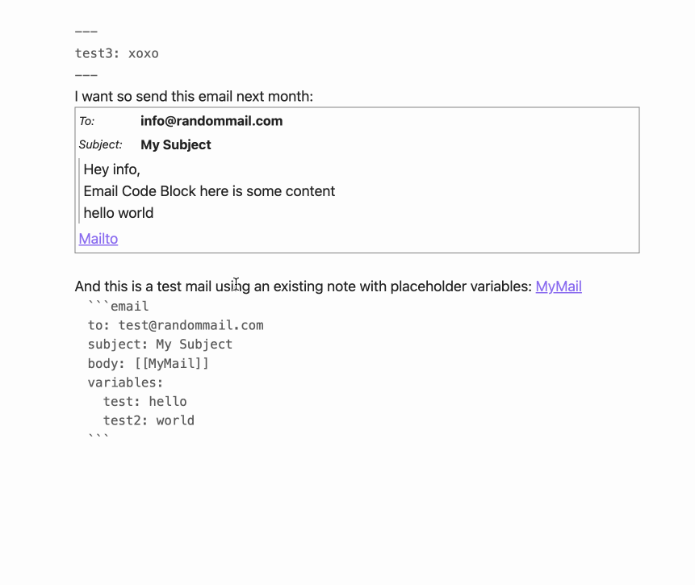

# Email Block for Obsidian [](https://github.com/joleaf/obsidian-email-block-plugin/releases) [](https://github.com/joleaf/obsidian-email-block-plugin/actions/workflows/release.yml) 

This plugin lets you plan small emails inside your [Obsidian](https://www.obsidian.md) notes.

## Install ..

### .. automatically in Obsidian (not yet)

1. Go to **Community Plugins** in your Obsidian Settings and **disable** Safe Mode
2. Click on **Browse** and search for "Email Block"
3. Click install
4. Toggle the plugin on in the **Community Plugins** tab

### .. manually from this repo

1. Download the latest [release](https://github.com/joleaf/obsidian-email-block-plugin/releases) `*.zip` file.
2. Unpack the zip in the `.obsidan/plugins` folder of your obsidian vault

## How to use

Add the "email" code block into your note:

````
```email
to: info@randommail.com
subject: My Subject
body: "Hey info,

  here is some content"
```
````

### Parameter

You can customize the view with the following parameters:

| Parameter  | Description                                                        | Values                     |
|------------|--------------------------------------------------------------------|----------------------------|
| to         | The main receiver of the mail. Multiple receiver seperated by ",". | String value               |
| cc         | The cc receiver of the mail. Multiple receiver seperated by ",".   | String value               |
| cc         | The bcc receiver of the mail. Multiple receiver seperated by ",".  | String value               |
| subject    | The subject of the email.                                          | String value               |
| body       | The body of the email.                                             | String value               |
| showmailto | Show the "mailto" link after the mail body.                        | true/false (Default: true) |

### Example



## How to dev

1. Clone this repo into the plugin folder of a (non-productive) vault (`.obsidian/plugins/`)
2. `npm i`
3. `npm run dev`
4. Toggle the plugin on in the **Community Plugins** tab

## Donate

<a href='https://ko-fi.com/joleaf' target='_blank'>
